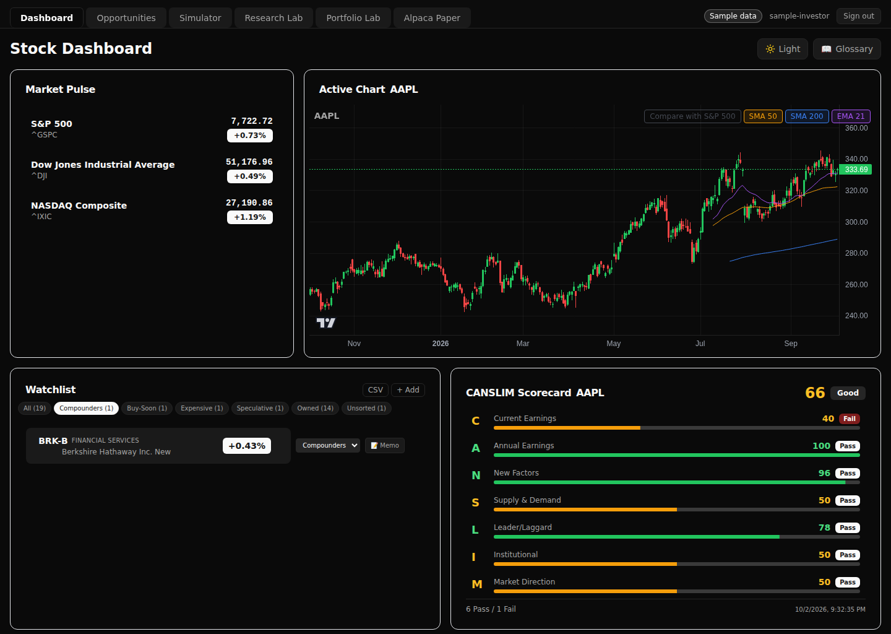
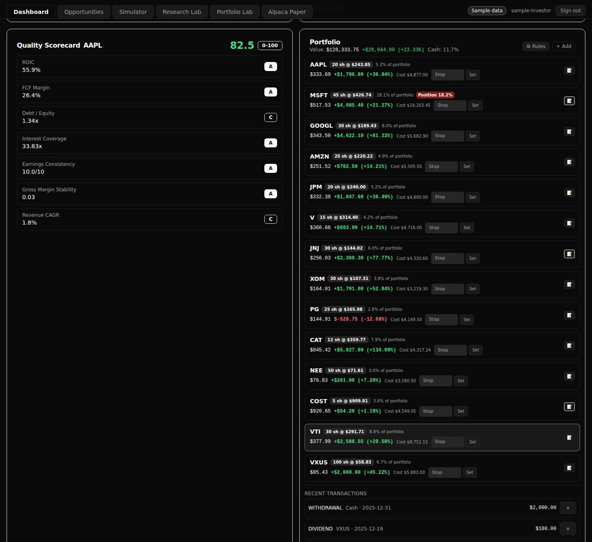
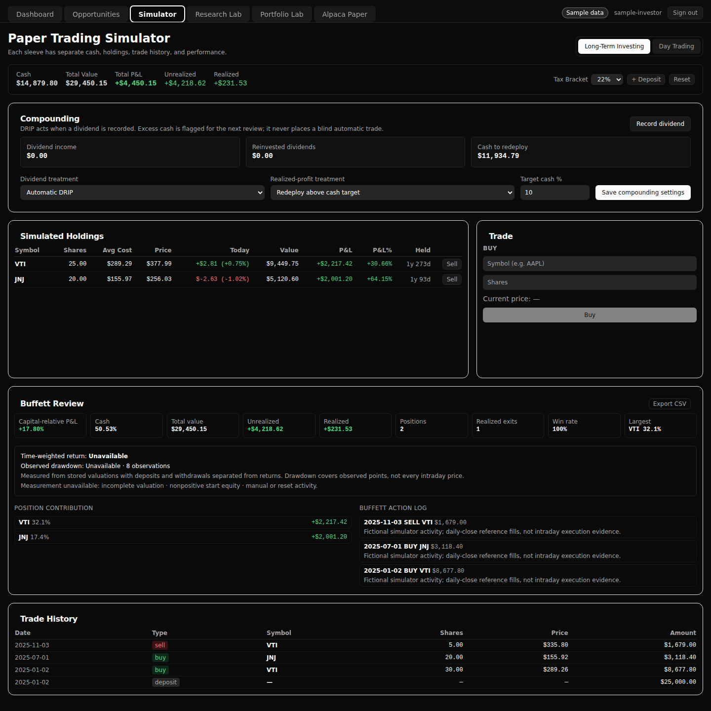
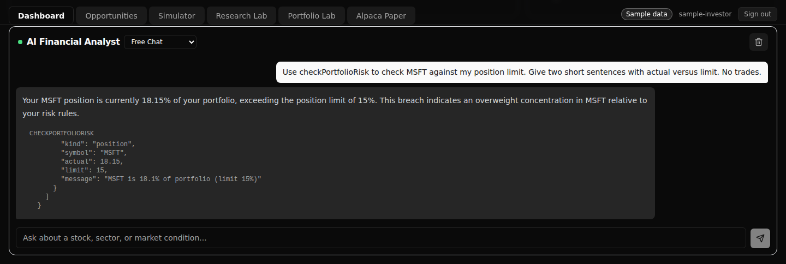
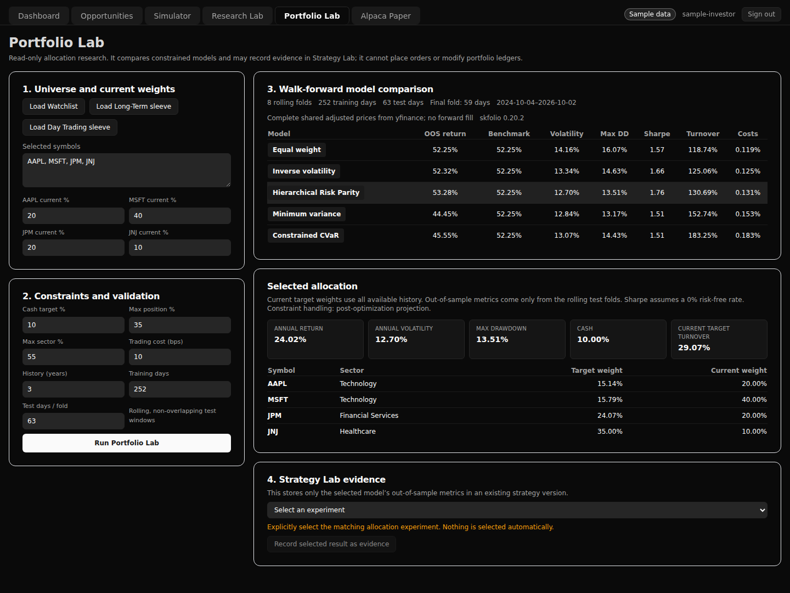
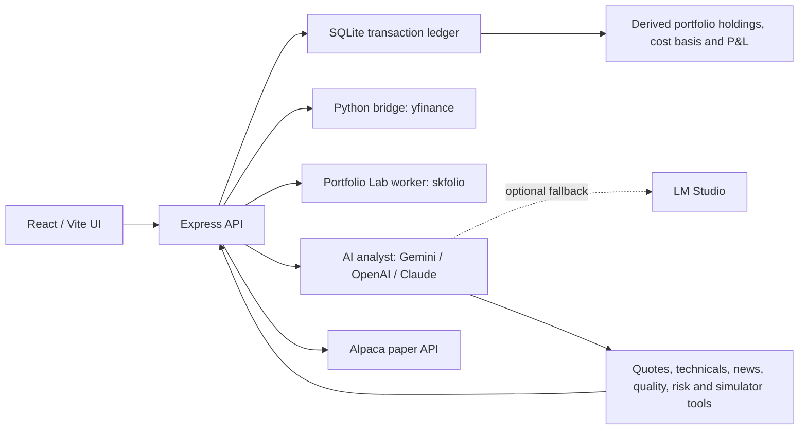

# Stock Dashboard

A self-hosted stock research and paper-trading workbench I use myself. It brings
market data, a transaction-ledger portfolio, risk rules, and an AI analyst with
tools into one app. The screenshots below use a fictional portfolio in a separate
sample database.



| Portfolio and risk rules | Paper-trading simulator |
|---|---|
| [](docs/screenshots/02-portfolio.png) | [](docs/screenshots/04-simulator.png) |

[](docs/screenshots/03-ai-analyst.png)

Live OpenAI response on the fictional account: the risk tool reports MSFT at
18.15% against a 15% position limit. No trades were requested or executed.

[](docs/screenshots/05-portfolio-lab.png)

**Two-minute walkthrough:** recording pending. There is no hosted demo; use the
[local sample setup](#local-sample-portfolio) to explore it yourself.

## What I built and owned

I owned the scope, architecture decisions, testing, deployment, and operations.
Built with AI coding agents, whose commits appear under **Stock Dashboard
Contributors**. My work includes defining the ledger and execution boundaries,
verifying behavior with tests, and diagnosing integration failures across Node,
Python, market-data providers, and paper-trading APIs.

## How it fits together



## Safety design, with evidence

| Boundary | Implementation | Enforcing tests |
|---|---|---|
| Broker configuration rejects the live Alpaca endpoint. | [Paper client](backend/services/alpaca_paper_service.js) | [Non-paper endpoint rejection](backend/test/alpaca_paper_service.test.js) |
| Manual paper-order entry is disabled by default. | [Order route](backend/routes/alpaca_paper.js) | [No broker request while disabled](backend/test/alpaca_paper_order_submission.test.js) |
| The v2 entry gate checks the kill switch, reconciliation, and monitor health; raw orders cannot bypass v2 account ownership. | [Entry gate](backend/services/alpaca_day_trade_v2_execution.js), [raw order gate](backend/routes/alpaca_paper.js) | [Entry refusals](backend/test/alpaca_day_trade_v2_execution.test.js), [account-wide route gate](backend/test/alpaca_day_trading_v2_routes.test.js) |
| Simulator API tokens are scoped to one sleeve and its allowed operations. | [Capabilities](backend/services/api_capabilities.js) | [Cross-sleeve and operation denials](backend/test/simulator_capabilities.test.js) |
| Chat receives an explicit tool allowlist; simulator trades still require the shared execution checks. | [AI tools](backend/services/ai_service.js) | [Tool scope, schemas and trade checks](backend/test/ai_simulator_tools.test.js) |
| Single-user login, capability-checked API access, and loopback binding by default. | [Authentication](backend/services/auth.js), [server](backend/server.js) | [Login and access tests](backend/test/auth.test.js), [listen configuration](backend/test/server_config.test.js) |
| Sample mode requires its marked database and uses separate credentials. | [Sample guards](backend/services/sample_mode.js), [launcher](backend/scripts/start-sample.js) | [Isolation and seed checks](backend/test/sample_mode.test.js) |

## Numbers

Counted from this branch and its passing test runs; test counts change as the app evolves.

| Measure | Count |
|---|---:|
| Backend JavaScript tests / test files | 719 / 73 |
| Frontend tests / test files | 72 / 23 |
| API route files | 19 |
| Standalone migration files | 2 |

Schema initialization also lives in `backend/database/db.js`. See [Tests](#tests)
for the commands, including the separate Portfolio Lab Python checks.

## Hard problems

- **One fill, two delivery paths:** [canonicalized REST activity IDs](https://github.com/reviaro/stock-app/commit/bf424bbeade55eee7e15917894458775df95ade3) so WebSocket and REST reconciliation don't double-count a fill.
- **Partial market-data bars:** [normalized finite Yahoo bars and strict JSON output](https://github.com/reviaro/stock-app/commit/c3f4955b786e5a71451e76c9af38f5376938b5bd) so missing values cannot break the Python-to-Node boundary.
- **Cancel versus fill:** [fixed a cancel/fill race](https://github.com/reviaro/stock-app/commit/f728b1a593e8479943cb6beb5eff290d3a63e956) in the paper execution lifecycle.

## Features

- **Market dashboard** — market pulse, sector rotation, stock charts, CANSLIM
  scorecard, quality scorecard (moat/health metrics), daily price history
  snapshots with range filtering, and a glossary.
- **Watchlist with buckets** — compounders / buy soon / expensive / speculative /
  owned / unsorted, with automatic bucket flips as you buy and sell.
- **Portfolio ledger** — every buy, sell, dividend, deposit, and withdrawal is a
  transaction row; cost basis (weighted average), cash, and realized/unrealized
  P&L are derived from the ledger, never stored.
- **Risk rails** — configurable position/sector/cash limits and per-symbol stop
  losses, with breach chips surfaced in the portfolio panel.
- **Research journal** — per-stock memos (thesis, fair value range, buy/trim
  levels, invalidation, conviction) plus structured research notes, with AI
  draft and bear-case pressure-test helpers.
- **Value screener** — scores candidates on quality vs. valuation.
- **Portfolio Lab** — read-only skfolio allocation research comparing equal
  weight, inverse volatility, HRP, minimum variance, and constrained CVaR with
  rolling walk-forward validation and optional Strategy Lab evidence capture.
- **AI analyst** — chat agent with tool access to live quotes, technicals,
  news, quality metrics, risk checks, and the simulator; plus five one-shot
  analyst modes (decision memo, bear case, compare, weekly review, monthly
  review). Supports Gemini, OpenAI API, Anthropic Claude API, and LM Studio.
- **Paper-trading simulator** — two isolated sleeves (Long-Term Investing and
  Day Trading), each with its own cash, holdings, trade history, FIFO tax
  preview (short/long-term split by your bracket), performance review, and CSV
  export. The AI agent can trade in either sleeve via `account_id`.

## Safety and scope

This project is educational and research software, not financial advice. It
does not guarantee returns. The broker integration supports Alpaca paper
trading only: the backend rejects the live trading endpoint, and paper-order
submission remains disabled unless its independent enablement controls are
explicitly configured.

Use only your own locally supplied credentials. Never commit API keys, session
secrets, runtime databases, portfolio exports, logs, or other personal
financial data.

## Architecture

```
frontend/   React 19 + TypeScript + Vite + Tailwind + React Query (port 5173, proxies /api → 3002)
backend/    Express (port 3002) + SQLite (backend/database/stocks.db) + node:test
  python/   yf_wrapper.py — yfinance quotes/quality/news via a venv (pybridge spawns it)
  portfolio_lab/  isolated skfolio worker, tests, requirements, and dedicated venv
```

The backend also serves `frontend/dist`, so a production build runs entirely
from port 3002.

## Setup

### Prerequisites

- Node.js **20.17.0 or newer** (required by the backend's `sqlite3` dependency)
- Python **3.11 or newer** (required by the backend's `pandas` dependency)

### Backend

```bash
cd backend
npm install
python3 -m venv venv && venv/bin/pip install -r python/requirements.txt
python3 -m venv portfolio_lab/venv && portfolio_lab/venv/bin/pip install -r portfolio_lab/requirements.txt
cp .env.example .env   # configure the required auth values documented below
node server.js         # http://localhost:3002
```

`.env` keys:

| Key | Purpose |
|-----|---------|
| `AI_PROVIDER` | `gemini` (default), `openai`, `anthropic`, or `lmstudio`; applies to chat, modes, memo drafts, and pressure tests |
| `AI_MODEL` | Model ID; required for OpenAI/Anthropic. Empty preserves the existing Gemini primary and backup models |
| `AI_LOCAL_FALLBACK` | `true` or `false`; defaults to enabled for Gemini and disabled for OpenAI/Anthropic. Never switches between cloud providers |
| `GOOGLE_GENERATIVE_AI_API_KEY` | API key for Gemini |
| `OPENAI_API_KEY` | API key for OpenAI |
| `ANTHROPIC_API_KEY` | API key for Anthropic Claude |
| `LMSTUDIO_BASE_URL` | Local model server (default `http://localhost:1234/v1`); uses Chat Completions |
| `LMSTUDIO_MODEL` | Model name as shown in LM Studio's server tab |
| `PYTHON_PATH` | Optional override for the venv python used by pybridge |
| `STOCK_DASHBOARD_USERNAME` | Required single-user login name |
| `STOCK_DASHBOARD_PASSWORD_HASH` | Required scrypt password hash; never store the plaintext password |
| `STOCK_DASHBOARD_SESSION_SECRET` | Required random session-signing secret of at least 32 characters |
| `STOCK_DASHBOARD_API_TOKEN` | Optional read-only bearer token for non-browser automation |
| `STOCK_DASHBOARD_ALLOW_LOOPBACK` | Permit tightly validated read-only `127.0.0.1` automation without a browser login; defaults to `1` |
| `STOCK_DASHBOARD_SIMULATOR_TOKENS` | JSON array of distinct `{account_id, token, manage_limits?}` credentials; tokens must contain at least 32 characters. Simulator trades are scoped to one sleeve; optional limit management does not grant operator powers. |
| `STOCK_DASHBOARD_HOST` | `127.0.0.1` by default; use `0.0.0.0` only in guarded LAN proxy mode |
| `STOCK_DASHBOARD_TRUSTED_PROXY_IP` | Exact LAN IPv4 allowed to proxy requests when `HOST=0.0.0.0`; all other non-loopback clients are rejected |
| `STOCK_DASHBOARD_PUBLIC_ORIGIN` | Exact HTTPS browser origin used for mutation Origin checks, such as `https://stocks.example.com` |
| `STOCK_DASHBOARD_SECURE_COOKIE` | Required explicit `0` or `1`; guarded LAN proxy mode requires `1` |
| `PYTHON_TIMEOUT_MS` | Maximum runtime for each market-data Python process; defaults to 45 seconds |
| `PYTHON_MAX_OUTPUT_BYTES` | Combined Python stdout/stderr limit; defaults to 5 MiB |
| `PORTFOLIO_LAB_PYTHON` | Optional override for the isolated Portfolio Lab Python executable |
| `PORTFOLIO_LAB_TIMEOUT_MS` | Maximum Portfolio Lab worker runtime; defaults to 180 seconds |
| `PORTFOLIO_LAB_MAX_OUTPUT_BYTES` | Combined Portfolio Lab worker output limit; defaults to 10 MiB |
| `ALPACA_API_KEY` / `ALPACA_API_SECRET` | Optional Alpaca **paper** credentials; never commit real values |
| `ALPACA_TRADING_BASE_URL` | Must remain `https://paper-api.alpaca.markets`; live endpoint is rejected |
| `ALPACA_PAPER_ORDER_ENTRY_ENABLED` | Paper-order master switch; disabled unless explicitly set to `true` |
| `ALPACA_PAPER_ORDER_ENTRY_TOKEN` | Independent token required by the paper-order and reconciliation routes |
| `DB_PATH_OVERRIDE` | Override the database used by Node and the Python cache reader/updater; unset keeps `backend/database/stocks.db` |
| `ENABLE_LEDGER_MIGRATION` | One-time legacy portfolio→ledger migration gate; leave unset for new installations and back up before migration |

Generate a password hash without putting the password in shell history:

```bash
cd backend
read -rsp "New password: " NEW_PASSWORD; echo
NEW_PASSWORD="$NEW_PASSWORD" node -e \
  "console.log(require('./services/auth').hashPassword(process.env.NEW_PASSWORD))"
unset NEW_PASSWORD
```

Copy the resulting `scrypt$...` value into `STOCK_DASHBOARD_PASSWORD_HASH`.
Generate `STOCK_DASHBOARD_SESSION_SECRET` with a cryptographically random secret,
for example `openssl rand -base64 48`. Restarting the backend invalidates existing
browser sessions.

### AI provider configuration

Set these values in `backend/.env`, or in **`backend/.env.sample`** when using
`npm run start:sample`. Restart that backend after changing them. Keys stay on
the server; the browser cannot choose a different provider or supply credentials.

| Provider | Settings |
|----------|----------|
| Gemini | `AI_PROVIDER=gemini`, `GOOGLE_GENERATIVE_AI_API_KEY=...`; optionally set `AI_MODEL` |
| OpenAI API | `AI_PROVIDER=openai`, `OPENAI_API_KEY=...`, `AI_MODEL=<your model ID>` |
| Anthropic Claude API | `AI_PROVIDER=anthropic`, `ANTHROPIC_API_KEY=...`, `AI_MODEL=<your model ID>` |
| LM Studio | `AI_PROVIDER=lmstudio`, `LMSTUDIO_MODEL=<loaded model name>`; no cloud key needed |

Choose an API model that supports tool calling. OpenAI uses the
[Responses API](https://developers.openai.com/api/docs/guides/function-calling);
Claude uses the [Anthropic adapter](https://ai-sdk.dev/providers/ai-sdk-providers/anthropic).
These integrations use API keys, not Codex or Claude Code CLI logins.

With no new settings, the existing Gemini primary/backup selection and local
fallback remain. `AI_MODEL` overrides the primary; Gemini still tries
`gemini-2.5-flash` as its backup unless that is already the primary.
OpenAI and Anthropic do not fall back to another cloud. To enable LM Studio
after either provider fails, set `AI_LOCAL_FALLBACK=true`; set it to `false`
to disable local fallback, including for Gemini. Fallback stops once response
content or tool input begins, so a partially executed conversation is not replayed.

All providers receive the same permitted dashboard tools and simulator checks.
The selected provider receives the conversation and any tool/context data used
to answer it. OpenAI requests set `store: false`. For recordings, use only the
sample portfolio and a key explicitly configured in `.env.sample`.

### Frontend

```bash
cd frontend
npm install
npm run dev     # http://localhost:5173 (proxies /api to 3002)
npm run build   # emits frontend/dist, served by the backend
```

### Local sample portfolio

Use this checkout to prepare screenshots and recordings with a fictional account.
After installing the prerequisites and dependencies above, run from the repo root:

```bash
cd frontend
npm run build
cd ../backend
npm run seed:sample
npm run start:sample
```

Open **http://127.0.0.1:3003** and sign in with **sample-investor** /
**sample-portfolio**. The header shows **Sample data**. These are public demo
credentials for a loopback-only local server; do not publish or proxy this mode.
The sample uses a separate session cookie, so it does not replace a normal login
on the same hostname. The ordinary `npm start` command is unchanged.

`seed:sample` creates only this checkout's `backend/database/sample.db`. It uses
the app's schema initialization/migrations and ledger functions, takes no CLI
arguments, and never reads the normal `.env`. An inherited `DB_PATH_OVERRIDE`
pointing anywhere else makes it refuse to run. It refuses symlinks, hard links,
unmarked existing databases and SQLite sidecars. Stop the sample server before
running the seed again: reseeding replaces the fictional account, including edits
made during a demo. A failed build preserves the previous sample database.
The generated database and lock files are git-ignored.

The fixture contains a $100,000 January 2025 deposit, 12 stocks and two ETFs,
buys/sells through December, illustrative dividends, one withdrawal, all six
watchlist buckets, three research memos with notes, risk rules, and trades in both
simulator sleeves. See [the scenario](backend/fixtures/sample/scenario.json),
[fixed price inputs](backend/fixtures/sample/prices.json), and
[expected accounting](backend/fixtures/sample/expected.json).
Trades use Yahoo Finance daily closes retrieved through yfinance with
`auto_adjust=False`, rounded to cents; the fixture records retrieval provenance.
Fills and dividend cash flows are fictional, not actual execution or distribution
records. Same-day simulator round trips use the same reference close plus fees;
they are not evidence of an intraday strategy's performance.

Reseeding needs no network. Expected portfolio cash is **$15,024.16**, realized
P&L is **$190.50**, and at the fixture's **2025-12-31** closes the only breach is
MSFT's position weight (**18.9%**, against a **15%** limit). The running app still
uses current market data when you open or refresh a page: values, P&L and breach
counts can change. Sample mode disables the universe-cache startup warm-up and
scheduled refresh, scheduled watchlist snapshots, and simulator performance
sampling. Normal mode keeps all three jobs enabled. This is not an offline or
frozen recording mode.

Before each capture, confirm the **Sample data** badge, check that all 14 holdings
have prices, and review the portfolio's cash and breach chips. The intended scene
has one MSFT position breach. If live prices change that scenario, adjust only the
fictional account's risk rules and check again; do not describe live values as the
dated fixture values. Do not trade or edit the account between related captures.

`start:sample` supplies an absolute database override, validates the seed marker
before initialization, binds to `127.0.0.1:3003`, and creates a fresh session secret.
It never seeds on startup or loads your normal `.env`, inherited broker keys,
operator tokens, or model credentials. Alpaca is unconfigured and broker order
entry stays disabled. Normal mode retains its existing database, auth and jobs.

For optional AI access, copy `backend/.env.sample.example` to
`backend/.env.sample` and configure a separate model key or a local LM Studio
model. Only the documented model/Python settings in that file are accepted by
the launcher; other settings are ignored. Live AI calls can incur provider costs.
The file is ignored by Git. No model call is required to seed or start the sample.

For frontend development against the sample backend:

```bash
cd frontend
VITE_DEV_BACKEND_TARGET=http://127.0.0.1:3003 npm run dev
```

Use a separate browser profile for recording. If an abnormal shutdown leaves
`backend/database/sample.db.lock`, first confirm no sample server or seed process
is running (the file contains its PID), then remove only that lock and retry.
Do not delete SQLite sidecars while a database process is running.

## Tests

See [simulator controls and evaluation](docs/simulator-controls.md) for the
scoped automation contract, adjustable risk limits, immutable runs, and rollout
requirements. New evaluated buys require an explicitly configured risk policy.

```bash
cd backend && npm test        # node --test — routes, ledger, tax math, migration, AI simulator tools
cd backend && portfolio_lab/venv/bin/python -m unittest portfolio_lab/test_worker.py -v
cd frontend && npm test       # vitest + testing-library
cd frontend && npx tsc -b     # type check
```

Backend tests stub the Python bridge and run against throwaway SQLite files, so
they need no network and never touch `stocks.db`.

## Notes

- The simulator's two sleeves live in `simulator_sleeves`; all simulator API
  routes and AI tools accept `account_id` (1 = long-term, default; 2 = day
  trading).
- Tax preview uses FIFO lot matching and your configured US bracket; long-term
  rates apply to lots held ≥ 365 days.
- Runtime databases and their backups may contain sensitive portfolio and
  transaction data. They are ignored by Git and must never be committed.

## License

Licensed under the MIT License. See [LICENSE](LICENSE).
